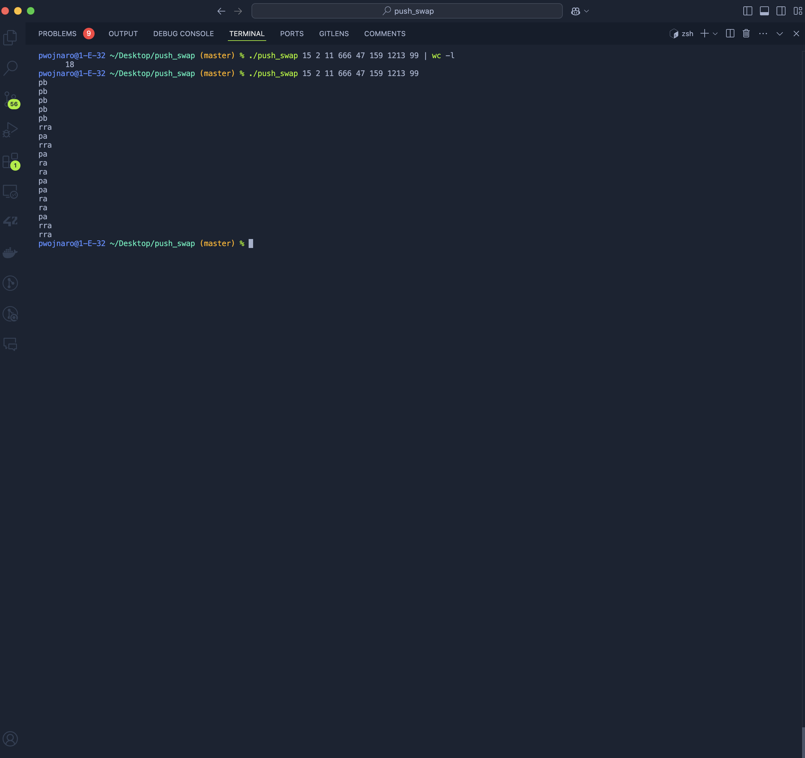

# push_swap

This project implements a sorting algorithm using two stacks and a limited set of operations. The goal is to sort a stack of integers in ascending order with the minimum number of operations.

## Table of Contents
- [About the Project](#about-the-project)
- [Features](#features)
- [Sorting Logic](#sorting-logic)
- [Instructions](#instructions)

## About the Project
The **push_swap** project is a C program that receives a list of integers as arguments and outputs a sequence of commands to sort the integers. The sorting process must use a minimal number of operations, making it an efficient, optimized solution for data sorting using stacks.

This project focuses on:
- Implementing a sorting algorithm in C.
- Managing stack-based data structures.
- Reducing time complexity and optimizing for minimal operations.

## Features
- **Two-stack sorting**: Uses two stacks (`a` and `b`) to manage data.
- **Standard sorting operations**: Swap, push, rotate, and reverse rotate commands to manipulate stacks.
- **Error handling**: Detects incorrect inputs, non-integer values, duplicates, and values out of the integer range.

## Sorting Logic
The sorting algorithm includes the following steps:
1. **Split Stack**: Moves all elements except the top three from stack `a` to stack `b`, reducing the problem size.
2. **Sort Three Elements**: Sorts the three elements left in stack `a`, ensuring a partially sorted setup.
3. **Transfer Nodes Back**: Transfers elements from stack `b` to stack `a` in the correct order by:
   - **Calibrating Nodes**: Determines the optimal position for each node from `b` in `a` and calculates the cost of insertion.
   - **Choosing Optimal Moves**: Moves each node from `b` to `a` using the fewest possible operations.
4. **Rotate to Smallest**: Once all elements are back in `a`, rotates `a` to bring the smallest element to the top.

## Instructions
1. Clone the repository.
2. Compile the program using `make`.
3. Run the program with a list of integers as arguments:

   ./push_swap <list of integers>

The output will be a series of commands that sorts the input stack.
